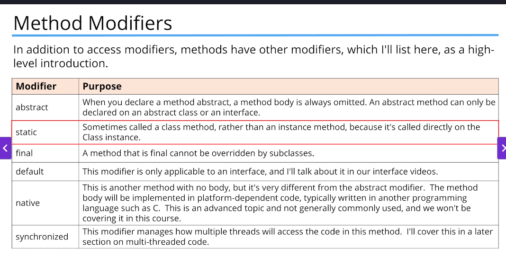

# Abstraction in Java

We use the terms like Abstraction and Generalization, when we start trying to model real world things in software.

You can generalize a set of characteristics and behaviour into an abstract type.

If you consider an octopus, a dog, and a penguin, you will probably say they're all animals.
An animal is really an abstract concept. An animal doesn't really exist, except as a way to describe a set of more specific things.

In Java, we can create an abstract class or interface to represent an abstract concept.

Abstraction simplifies the view of a set of item's traits and behavior, so we can talk about them as a group, as well as generalize their functionality.

Java also allows us to create a class hierarchy, where the top of the hierarchy, the base class, is usually an abstract concept, whether it's an abstract class or not.


## Abstract Class

An abstract method has a method signature, and a return type, but doesn't have a method body. (It is unimplemented)

A concrete method has a method body, usually with at least one statement.

An abstract class is a class that contains at least one abstract method.

```java
abstract class Animal {}
```

An abstract class is a class that's incomplete.

You can't create an instance of an abstract class.

An abstract class can still have a constructor, which will be called by its subclasses during their construction.

An abstract class's purpose is to define the behavior its subclasses are required to have, so it always participates in inheritance.

```java
class Dog extends Animal {}

abstract class Mammal extends Animal {}

abstract class BreedOfDog extends Dog {}
```

An abstract method is declared with the modifier abstract and can not be instantiated.

```java
abstract class Animal {
    public abstract void move();
}
```

An abstract method tells the outside world that all Animals will move. The subclass won't compile if it doesn't implement the abstract methods.

Abstract methods cannot be private.

Constructor declared in abstract class must be called by its subclasses.

## Interfaces

An interface is a reference type in Java, similar to a class, that can contain only constants, method signatures, default methods, static methods, and nested types.

An interface is a contract between the interface and the class that implements it.

An interface lets us treat an instance of a single class as many different types.

By declaring it's using an interface, your class must implement all the abstract methods on the interface.

An interface lets classes that might have little else in common be recognized as a special reference type.

```java
public interface FlightEnabled {}

public class Bird implements FlightEnabled {}

FlightEnabled bird = new Bird();
```

A class can only extend a single class but can implement many interfaces.

If you omit an access modifier on a class member, it's implicitly package private.

If you omit an access modifier on an interface member, it's implicitly public.

Changing the access modifier of a method to protected on an interface, is a compiler error, whether the method is concrete or abstract.

An interface can extend multiple interfaces.

An interface can't extend a class.

The final static field, is what you're really creating, when you declare a field on an interface.

An extension method is identified by the modifier default, it has a method body, even if the body is just an empty set of curly braces.

Just like overriding a method on a class, you have three choices when you override a default method on an interface.

- You can choose not to override it at all
- You can override the method and write code for it, so that the interface method isn't executed
- Or you can write your own code, and invoke the method on the interface, as part of your implementation.

## Method Modifiers



When we use the final modifier, we prevent any further modifications to that component.
A final class can not be overridden, meaning no class can use it in the extends clause.


## Interface vs Abstract Class


