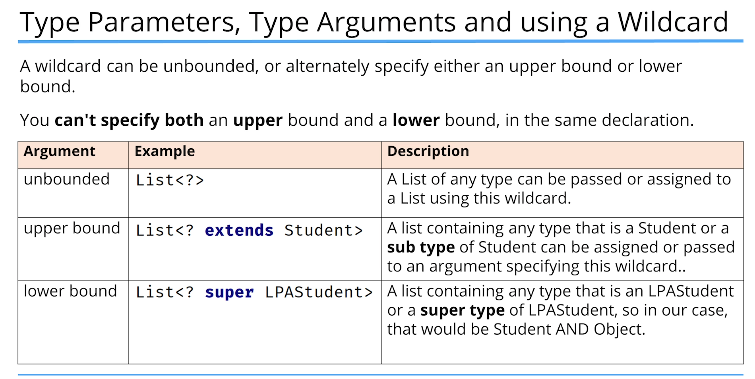

# Generics

Generics enable us to create and design classes in a generalized manner, without being concerned about the specific details of the elements they might contain.

Generics are a feature of the Java programming language that allows you to define classes, interfaces, and methods that operate on objects of a specified type.

ArrayList is a generic.

Through the use of generics, it is possible to create classes, interfaces, and methods that will work in a type-safe manner with various kinds of data.

### Regular Class

```java
class Tell {
    private String field;
}
```

```java
class Gen<T> {
    T ob; // declare an object of type T
    
    // Pass the constructor a reference to an object of type T
    Gen(T o) {
        ob = o;
    }
    
    // Return ob
    T getob() {
        return ob;
    }
    
    // Show type of T
    void showType() {
        System.out.println("Type of T is " + ob.getClass().getName());
    }
    
    // Demonstrate the generic class
    class GenDemo {
        public static void main(String[] args) {
            // Create a Gen reference for Integer
            Gen<Integer> iOb;
            
            // Create a Gen<Integer> object and assign its reference to iOb
            iOb = new Gen<Integer>(88);
            
            // Show the type of data used by iOb
            iOb.showType();
            
            // Get the value in iOb. Notice that no cast is needed
            int v = iOb.getob();
            System.out.println("Value: " + v);
            
            System.out.println();
            
            // Create a Gen object for String
            Gen<String> strOb = new Gen<String>("Generics Test");
            
            // Show the type of data used by strOb
            strOb.showType();
            
            // Get the value in strOb. Again, no cast is needed
            String str = strOb.getob();
            System.out.println("Value: " + str);
        }
    }
}
```
Here T (contained within <>) is a type parameter, this name is used as a placeholder for the actual type that will be passed to Gen when an object is created.

Java compiler does not create different versions of Gen, or of any other generic class.

The reference returned by new must also be of type Gen<Integer>.

`iob = new Gen<Double>(88.0); // results in error`
`iob = new Gen<Integer>(88); // correct - makes use of autoboxing to encapsulate the value 88`

### Generic Class

Generics will only work with reference types, not with primitive types.

A reference of one specific version of a generic type is not type compatible with another version of the same generic type.

Generics automatically ensure the type safety of all operations involving the generic type.
Through generics, run-time errors are converted tnto compile-time errors.

```java
class generic<T> {
    private T field;
}

public class Team<T extends Player> {} // T has to be a Player or subtype of Player
```

T is the placeholder for a type that will be specified later.

This is called a type identifier, and it can be any letter or word, but T which is short for Type is most commonly used.

In the declaration of a reference type that uses generics, the type parameter is declared in angle brackets.

The reference type is ArrayList, the type parameter ( or parameterized type) is String, which is declared in angle brackets, and listOfString is the variable name.

You can declare more than one type parameter in a generic type.

## Generic Class with Two Type Parameters

```java

class TwoGen<T, V> {
    T ob1;
    V ob2;

    TwoGen(T o1, V o2) {
        ob1 = o1;
        ob2 = o2;
    }

    void showTypes() {
        System.out.println("Type of T is " + ob1.getClass().getName());
        System.out.println("Type of V is " + ob2.getClass().getName());
    }
    
    T getOb1() {
        return ob1;
    }
    
    V getOb2() {
        return ob2;
    }
}

class SimpGen {
    public static void main(String[] args) {
        TwoGen<Integer, String> tgObj = new TwoGen<Integer, String>(88, "Generics");
        
        // show the types
        tgObj.showTypes();
        
        // obtain and show values
        int v = tgObj.getOb1();
        System.out.println("Value of T: " + v);
        
        String str = tgObj.getOb2();
        System.out.println("Value of V: " + str);
    }
}
    
```

Java provides bounded types, which allow you to restrict the kinds of types that can be used as type arguments in a generic class.

`<T extends SUPERCLASS>`

## Wildcards and Bounded Wildcards

The wildcard argument is specified by the `?` symbol, and it represents an unknown type.
Wildcards can be bounded as well.

`<? extends TYPE>` indicates an unknown type that is a subtype of TYPE.

`<? super TYPE>` indicates an unknown type that is a supertype of TYPE.

## Generic Methods

It is possible to declare a generic method that uses one or more type parameters of its own.
Generic methods can be overridden.

## Generic Constructors

It is possible for constructors to be generic, even if their class is not.

## Generic Interface

A generic interface is defined in the same way as a generic class, by including a type parameter in angle brackets after the interface name.

It is acceptable for a non-generic class to be the superclass of a generic subclass.

## How Erasure works

When your Java code is compiled, all generic type information s removed (erased).
This means replacing type parameters with their bound type, which is Object if no explicit bound is specified, and then applying the appropriate casts (as determined by the type arguments) to maintain type compatibility with the types specified in type arguments.
The compiler also enforces this type compatibility. This approach to generics means that no type parameters exist at run time. They are simply source code mechanism.

### Bridge Methods

Occasionally, the compiler will need to add a bridge method to a class to handle situations in which the type erasure of an overriding method in a subclass does not produce the same erasure as the method in the superclass.
In this case, a method is generated that uses the type erasure of the superclass, and this method calls the method that has the type erasure specified by the subclass.
Bridge methods only occur at the bytecode level.

Ambiguity errors occur when erasure causes two seemingly distinct generic declarations to resolve the same erased type, causing a conflict.

No static method can use a type parameter declared by the enclosing class.

A generic class cannot extend Throwable.

```java
ArrayList<String> listOfString;
```

The most commonly used type parameter identifiers are:

- E for an element
- K for a key
- V for a value
- N for a number
- T for a type
- S, U, V, and so forth for multiple types

Generics allow the compiler to do compile-time type checking when adding and processing elements in the list.

Generics simplify code, because we don't have to do our own type checking and casting as we would if the type of our elements was Object.

For a method, type parameters are placed after any modifiers and before the method's return type.

The type parameter can be referenced in method parameters, as the method return type, and in the method code block, much as we have seen how a class's type parameter can be used.

A generic method can be used for collections with type arguments to allow variability of the elements in the collection, without using a raw version of the collection.

A generic method can be used for static methods on a generic class, because static methods can't use class type parameters.

A generic method can be used on a non-generic class, to enforce type rules on a specific method.

The generic method type parameter is separate from a generic class type parameter.

```java
public <T> String myMethod(T input){
    return input.toString();
}
```

## Type Parameters, Type Arguments and using a wildcard

Type parameters are used to define the type of elements in a generic class or method.

A type parameter is a generic class, or generic method's declaration of the type. You can bind a type parameter with the use of the extends keyword, to specify an upperbound.

```java
// generic class

public class Team<T> {};

//generic method

public <T> void doSomething(T t) {};
```

A type argument declares the type to be used, and is specified in a type reference, such as a local variable reference, method parameter declaration, or field declaration.

```java
// generic class
Team<BaseballPlayer> team = new Team<>();
```

A wildcard can only be used in a type argument, not in the type parameter declaration.

A wildcard is represented by the ? character.

A wildcard means that the type is unknown.

```java
List<?> unknownList;
```

A wild card can't be used in an instantiation of a generic class.

```java
// code shown below is invalid
var myList = new ArrayList<?>();
```



```java
public static void testList(List<?> list) {
    for (Object o : list) {
        System.out.println(o);
    }
}
```

Class's type parameter cannot be used with a static method, the generic class's type parameter only has meaning for the instance and therefore instance methods at the class level the generic is unknown.

When generic classes are loaded into memory, the type parameter is erased, and the class is loaded as a raw type. A generic method's type is unrelated to the type declared on the generic class.

```java
public static <T> List<T> getMatches (List<T> items){};
//the T after static and the T in List<T> are treated differently

```

