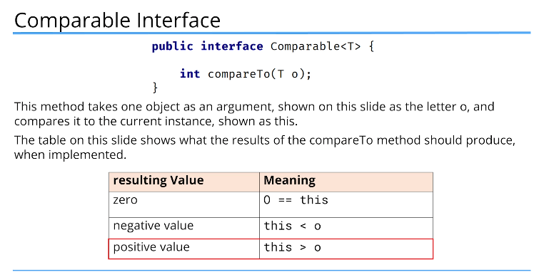
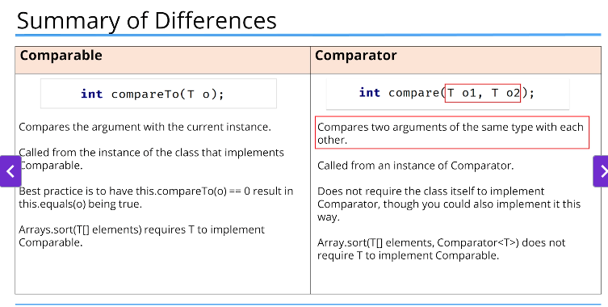

# Comparable



```java
// comparator
public interface Comparator<T> {
    int compare(T O1, T O2);
}

//Comparable
public interface Comparable<T> {
    int compareTo(T o);
}

```

It is common practice to include a Comparator as a nested class.

