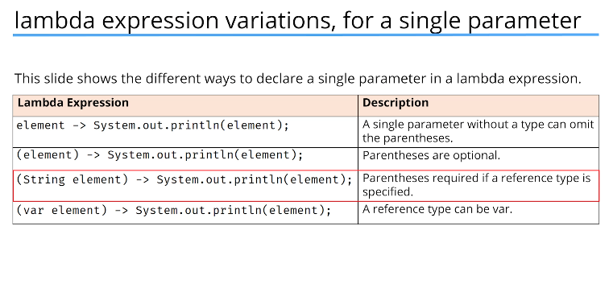
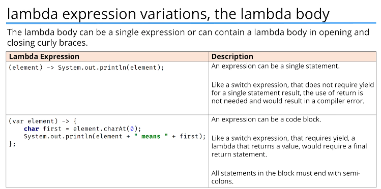
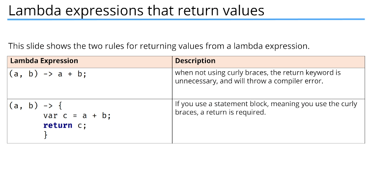
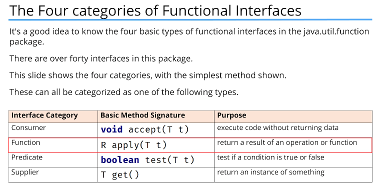

# Lambda Expressions

Lambda expressions allow you to pass blocks of code as parameters, offering a powerful and flexible way to write cleaner and more functional code with minimal effort.
These compact and expressive constructs can greatly simplify your programming tasks.

Method references build on this concept, providing an even more concise way to refer to existing methods using lambda expression syntax.

For a lambda expression the method is inferred by java.

For a lambda expression to be valid it must adhere to following rules:
- It must have a parameter list
- It must have an arrow token (->)
- It must have a body
- It must have a return type

Java requires types which support lambda expressions to be functional interfaces. 

A functional interface is an interface with a single abstract method.










Key to understanding Java's implementation of lambda expressions are two constructs. The first is lambda expression, itself. The second is the functional interface.

A lambda expression is, essentially, an anonymous method - a block of code that can be passed around to be executed later. Lambda expressions are defined using a special syntax that includes a parameter list, an arrow token (->), and a body.

A functional interface is an interface that contains a single abstract method. This method defines the signature of the lambda expression that can be used with the interface. Functional interfaces can also contain default methods and static methods, but they must have only one abstract method to be considered functional.

### Example:

```java
import java.util.Arrays;
import java.util.List;
import java.util.function.Consumer;
public class LambdaExample {
    public static void main(String[] args) {
        List<String> names = Arrays.asList("Alice", "Bob", "Charlie");

        // Using a lambda expression to define the action to be performed on each element
        names.forEach(name -> System.out.println("Hello, " + name + "!"));

        // Using a method reference as a more concise alternative
        names.forEach(System.out::println);
    }
}
```

The lambda operator (->) divides the lambda expression in two parts.

The left side specifies the parameters required by the lambda expression. The right side contains the body of the lambda expression, which is the code that is executed when the lambda expression is invoked.

Java defines two types of lambda bodies:

1. Expression Body: An expression body consists of a single expression. The value of this expression is returned by the lambda expression. For example:
```java
(x, y) -> x + y
```
2. Block Body: A block body consists of multiple statements enclosed in curly braces {}. In this case, you need to use the return statement to return a value if the lambda expression has a return type. For example:
```java
(x, y) -> {
    int sum = x + y;
    return sum;
}
```
### Functional Interface

A functional interface is an interface that contains exactly one abstract method. This single abstract method defines the signature of the lambda expression that can be used with the interface. Functional interfaces can also contain default methods and static methods, but they must have only one abstract method to be considered functional.
Functional interfaces are often used as the target types for lambda expressions and method references. When you create a lambda expression, it is automatically converted into an instance of the functional interface.
### Example:

```java
@FunctionalInterface
interface MathOperation {
    int operate(int a, int b);
}
public class FunctionalInterfaceExample {
    public static void main(String[] args) {
        // Using a lambda expression to implement the operate method
        MathOperation addition = (a, b) -> a + b;
        MathOperation multiplication = (a, b) -> a * b;

        System.out.println("Addition: " + addition.operate(5, 3)); // Output: Addition: 8
        System.out.println("Multiplication: " + multiplication.operate(5, 3)); // Output: Multiplication: 15
    }
}
```

### Generic Functional Interface

A generic functional interface is a functional interface that uses type parameters to allow for flexibility in the types of data it can operate on. This means that you can define a functional interface with one or more type parameters, and when you implement the interface using a lambda expression or method reference, you can specify the actual types to be used.
### Example:

```java
@FunctionalInterface
interface GenericOperation<T, R> {
    R apply(T t);
}
public class GenericFunctionalInterfaceExample {
    public static void main(String[] args) {
        // Using a lambda expression to implement the apply method for Integer to String conversion
        GenericOperation<Integer, String> intToString = (Integer i) -> "Number: " + i;

        // Using a lambda expression to implement the apply method for String to Integer conversion
        GenericOperation<String, Integer> stringToLength = (String s) -> s.length();

        System.out.println(intToString.apply(5)); // Output: Number: 5
        System.out.println(stringToLength.apply("Hello")); // Output: 5
    }
}
```

A lambda expression can throw an exception. However, if it throws a checked exeception, then that exception must be compatible with the exception(s) listed in the throws clause of the abstract methods in the functional interface.

```java
@FunctionalInterface
interface ExceptionOperation {
    void execute() throws Exception;
}
public class LambdaExceptionExample {
    public static void main(String[] args) {
        // Using a lambda expression that throws a checked exception
        ExceptionOperation operation = () -> {
            if (true) { // Simulating a condition that causes an exception
                throw new Exception("An error occurred!");
            }
        };

        try {
            operation.execute();
        } catch (Exception e) {
            System.out.println(e.getMessage()); // Output: An error occurred!
        }
    }
}
```

Variables defined by the enclosing scope of a lambda expression are accessible within the lambda expression.

A lambda expression can use both instance and static variables of the enclosing class.

A lambda expression also has access to this ( both explicitly and implicitly), which refers to the instance of the enclosing class.

```java
import java.util.function.Consumer;
public class LambdaScopeExample {
    private String instanceVariable = "Instance Variable";

    public void demonstrateLambdaScope() {
        String localVariable = "Local Variable";

        Consumer<String> printVariables = (input) -> {
            System.out.println("Input: " + input);
            System.out.println("Accessing " + instanceVariable); // Accessing instance variable
            System.out.println("Accessing " + localVariable); // Accessing local variable
            System.out.println("Accessing this.instanceVariable: " + this.instanceVariable); // Accessing using this
        };

        printVariables.accept("Hello, World!");
    }

    public static void main(String[] args) {
        LambdaScopeExample example = new LambdaScopeExample();
        example.demonstrateLambdaScope();
    }
}
```

When a lambda expression uses a local variable from its enclosing scope, a special situation is created that is referred to as a variable capture.
In this case, a lambda expression may only use local variables that are effectively final. A local variable is effectively final if its value is not changed after it is initialized.

```java
import java.util.function.Consumer;
public class LambdaEffectivelyFinalExample {
    public static void main(String[] args) {
        String message = "Hello, World!"; // Effectively final variable

        Consumer<String> printMessage = (input) -> {
            System.out.println(input + " - " + message);
        };

        printMessage.accept("Greeting");
        
        // Uncommenting the following line would cause a compilation error
        // message = "New Message"; // This would make 'message' not effectively final
    }
}
```

A local variable of the enclosing scope cannot be modified by the lambda expression.

```java
import java.util.function.Consumer;
public class LambdaModifyVariableExample {
    public static void main(String[] args) {
        int count = 0; // Local variable

        Consumer<String> printAndModify = (input) -> {
            System.out.println(input + " - Count: " + count);
            // count++; // Uncommenting this line would cause a compilation error
        };

        printAndModify.accept("Hello");
    }
}
```

## Method Reference

A method reference provides a way to refer to a method without executing it. 
It relates to lambda expressions because it, too, requires a target type that is a functional interface.

When evaluated a method reference also creates an instance of the functional interface.

### Method References to static method

`className::methodname`

```java
import java.util.Arrays;
import java.util.List;
import java.util.function.Consumer;
public class MethodReferenceStaticExample {
    public static void main(String[] args) {
        List<String> names = Arrays.asList("Alice", "Bob", "Charlie");

        // Using a method reference to a static method
        names.forEach(MethodReferenceStaticExample::printName);
    }

    public static void printName(String name) {
        System.out.println("Hello, " + name + "!");
    }
}
```
### Method References to instance method of particular object
`instance::methodname`
```java
import java.util.Arrays;
import java.util.List;
import java.util.function.Consumer;
public class MethodReferenceInstanceExample {
    public static void main(String[] args) {
        List<String> names = Arrays.asList("Alice", "Bob", "Charlie");

        MethodReferenceInstanceExample example = new MethodReferenceInstanceExample();

        // Using a method reference to an instance method of a particular object
        names.forEach(example::printName);
    }

    public void printName(String name) {
        System.out.println("Hello, " + name + "!");
    }
}
```

## Sample Implementation of higher order functions in Java using Method References

```java
interface StringFunc {
    String func(String n);
}

class MyStringops {
    String strReverse(String str) {
        String result = "";
        for (int i = str.length() - 1; i >= 0; i--)
            result += str.charAt(i);
        return result;
    }
}

class MethodRefDemo {
    static String stringOp(StringFunc sf, String s) {
        return sf.func(s);
    }
    
    public static void main(String args[]) {
        String inStr = "Lambdas and Java";
        String outStr;
        
        MyStringOps strOps = new MyStringOps();
        
        outStr = stringOp(strOps::strReverse, inStr);
        
        System.out.println("Original string: " + inStr);
        System.out.println("Reversed string: " + outStr);
    }
}
```


### Method References with Generics

```java
@FunctionalInterface
interface GenericFunc<T> {
    T func(T n);
}
class GenericOps {
    <T> T reverse(T str) {
        String s = str.toString();
        String result = "";
        for (int i = s.length() - 1; i >= 0; i--)
            result += s.charAt(i);
        return (T) result;
    }
}
class GenericMethodRefDemo {
    static <T> T genericStringOp(GenericFunc<T> gf, T s) {
        return gf.func(s);
    }
    
    public static void main(String args[]) {
        String inStr = "Generics and Method References";
        String outStr;
        
        GenericOps genOps = new GenericOps();
        
        outStr = genericStringOp(genOps::reverse, inStr);
        
        System.out.println("Original string: " + inStr);
        System.out.println("Reversed string: " + outStr);
    }
}
```

When a generic method is specified as a method reference, its type argument comes after the :: and before the method name.

## Constructor References

A constructor reference is a special type of method reference that refers to a constructor of a class.
`ClassName::new`

```java
import java.util.function.Supplier;
public class ConstructorReferenceExample {
    public static void main(String[] args) {
        // Using a constructor reference to create an instance of MyClass
        Supplier<MyClass> myClassSupplier = MyClass::new;

        MyClass myClassInstance = myClassSupplier.get();
        myClassInstance.displayMessage();
    }
}
class MyClass {
    public MyClass() {
        // Constructor
    }

    public void displayMessage() {
        System.out.println("MyClass instance created using constructor reference!");
    }
}
```

## Predefined Functional Interfaces

Java provides several predefined functional interfaces in the `java.util.function` package. Some commonly used ones include:

- `Function<T, R>`: Represents a function that takes an argument of type T and returns a result of type R.
- `Consumer<T>`: Represents an operation that takes an argument of type T and returns no result.
- `Supplier<T>`: Represents a supplier of results of type T.
- `Predicate<T>`: Represents a predicate (boolean-valued function) of one argument of type T.
- and more