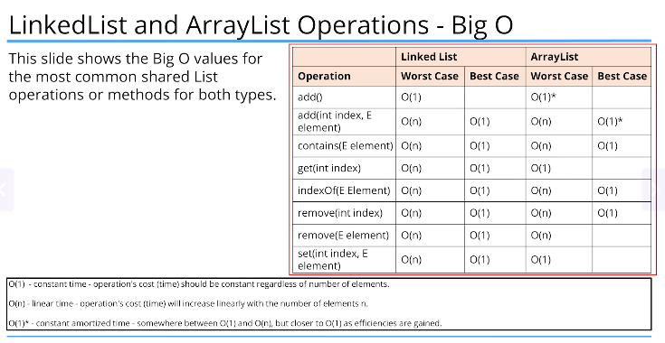

# Lists

Some object-oriented languages don't support any primitive data types at all, meaning everything is an object.

BUt most of the more popular object-oriented languages of the day, including Java, support both primitive types and objects.

Primitive types generally represent the way data is stored on an operating system.

Primitives have some advantages over objects, especially as the number of elements you need to store increase.

Objects take up additional memory and may require a little more processing power.

We know we can create objects, with primitive data types as field types, for example, and we can also return primitive types from methods.

ArrayList or LinkedList don't support primitive data types as a collection type.

Java gives us wrapper classes for each primitive type.

When we go from a primitive type to a wrapper it's called boxing.

When we go from a wrapper to a primitive type it's called unboxing.

A primitive is boxed, or wrapped, in a containing class, whose main data is the primitive value.

Each primitive data type has a wrapper class, as shown on the list.

Each wrapper type boxes a specific primitive value.

### How do we box?

Each wrapper has a static overloaded factory method, valueOf, which takes a primitive as an argument and returns an instance of the wrapper class.

```java
Integer boxedInt = Integer.valueOf(15); // better space and time performance but unnecessary
Integer boxedInt1 = new Integer(14); // deprecated since Java 9 
```

In truth, we rarely have to manually box primitives, because Java supports something called autoboxing.

Autoboxing is where Java automatically boxes a primitive type for you, hence the term autoboxing.

```java
Integer boxedInt = 15;
```

This makes it easy to assign a primitive to a wrapper variable.

Every wrapper class supports a method to return the primitive value it contains, this is called unboxing.

```java
Integer boxedInteger = 15;
int unboxedInt = boxedInteger.intValue();
```
Just like boxing it is unnecessary to manually unbox, automatic unboxing is really just referred to as unboxing in most cases.

```java
int unboxedInt = boxedInteger;
```


Two of the most common classes for lists are ArrayLIst and LinkedList

A list is a special type in Java, called an Interface.

ArrayList is a class that maintains an array in memory that's actually bigger than what we need in most cases

ArrayList is resizeable

ArrayList does not support primitive types

YOu should use a specific type rather than just the Object class because Java can then perform compile-time type checking.

### Multi-DImensional ArrayList

```java
ArrayList<ArrayList<String>> multiDList = new ArrayList<>();
System.out.println(multiDList);
```
Arrays.asList returns a list which is not resizeable but is mutable
List.of returns a list which is immutable

## Memory and Big O Notation Arrays, ArrayList, LinkedList

For array of primitive values the values are stored in a contiguous manner, java can use simple math using the idnex and the address of the initial element in the array to get the address and retrieve the value of the element

For reference type (meaning anything that's not a primitive type) like a String or any other object, the array elements aren't the values, but the addresses of the referenced object or String.
This means that our objects aren't stored contiguously in memory, but their addresses are, in the array behind the ArrayList.

The addresses can be easily retrieved with a bit of math, if we know the index of the element.

This is a cheap or fast lookup and doesn't change no matter what size the ArrayList is.
But to remove an element, the referenced addresses have to be re-indexed or shifted to remove an empty space.
And when adding an element, the array that backs the ArrayList might be too small and might need to be reallocated.

Either of these operations can be an expensive or time-consuming process if the number of elements is large.

An ArrayList is created with an initial capacity depending on how many elements we create the list with or if you specify a capacity when creating the list.

```java
ArrayList<Integer> intList = new ArrayList<>(10);
for(int i =0; i < 7; i++) {
    intList.add((i + 1) * 5);
}
intList.add(18);
intList.add(18);
intList.add(18);
intList.add(18);
```

FRom Java documentation - THe details of the growth policy are not specified beyond the fact that adding an element, has constant amortized time cost. i.e. O(n)

**Big O**

Big O approximates the cost of an operation for a certain number of elements called n.
Cost is usually determined by the time it takes, but it can include memory usage and complexity.

IN a perfect world, an operation's time and complexity would never change. This ideal world, in Big O notation is O(1) - constant time

In many situations, an operation's cost is in direct correlation to the number of elements, n. In Big O notation this is O(N) - linear time
if 10 elems then cost is 10 times that of 1 element (O(1))


## LinkedList

The LinkedList is not indexed at all.
There is no array storing the addresses in a neat, ordered way, as we saw with the ArrayList.

Instead, each element that's added to a linked list forms a chain and the chain has links to the previous element, and the next element.
THis architecture is called a doubly linked list, emaning an element is linked to the next element, but it's also linked to a previous element, in this chain of elements.

The beginning of the chain is called the head of the lsit, and the end is called the tail

In contrast to an ArrayList, inserting or removing an item in LinkedList is just a matter of breaking two links in the chain, and re-establishing two different links.
No new array needs to be created, and elements don't need to be shifted into different positions.

A reallocation of memory to accommodate all existing elements is never required.

For a LinkedList, inserting and removing elements is generally considered cheap in computer currency to doing these functions in an ArrayList



When removing elements, a LinkedList will be more efficient because it doesn't require re-indexing, but the element still needs to be found using the traversal mechanism, which is why it is O(n) as the worst case
REmoving elements from the start of the list will be more efficient for LinkedLIst


The ArrayList is usually the better default choice for a List, especially if the List is ised predominantly for storing and reading data.

An ArrayList's index is an int type, so an ArrayList's capacity is limited to the maximum number of elements an int can hold (2,147,483,647)

YOu may want to consider using a LinkedList if you're adding and processing or manipulating a large amount of elements, and the maximum elements isn't known but may be great (possibly greated than maximum supported integer value)

A linkedlist can be more efficient when items are being processed predominantly from either the head or tail of the list


## LinkedList

An ArrayList is implemented on top of an array, but a LinkedList is a doubly linked list.
Both implement all of list's methods but the linkedlist also implements the Queue and Stack methods as well

Iterators are a way to traverse lists.

AN iterator can be thought of as something similar to a database cursor ( enables traversal over records in a database)

next() to get next method and hasNext() to check if there are more elements after current one

An iterator is forwards only and only supports the remove method.

A ListIterator allows you to navigate both forwards and backwards, besides the remove method, it also supports the add and set methods

