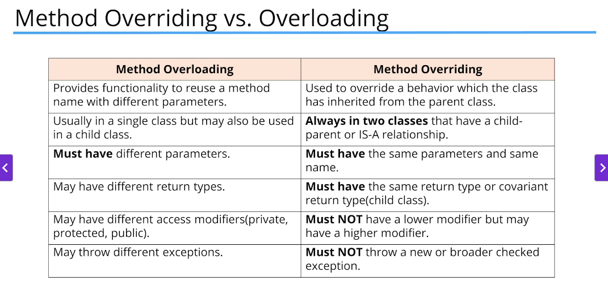

# Object Oriented Programming

Fundamental features of OOP
 - Inheritance
 - Encapsulation
 - Polymorphism
 - Composition
 - Abstraction

Object-Oriented Programming (OOP) is a programming paradigm based on the concept of "objects", which can contain data and code to manipulate that data. Here are the fundamental features of OOP:

1. Inheritance: This allows a class to inherit properties and methods from another class. It promotes code reusability and establishes a relationship between parent and child classes.
2. Encapsulation: This is the bundling of data and methods that operate on the data within one unit, e.g., a class. It restricts direct access to some of the object's components, which can prevent the accidental modification of data.
3. Polymorphism: This allows objects to be treated as instances of their parent class rather than their actual class. The most common use of polymorphism is when a parent class reference is used to refer to a child class object.
4. Composition: This is a design principle where a class is composed of one or more objects from other classes, implying a has-a relationship. It is used to build complex types by combining objects of other types.
5. Abstraction: This is the concept of hiding the complex implementation details and showing only the necessary features of an object. It helps in reducing programming complexity and effort.

If a field is static, there is only one copy in memory, and this value is associated with the class or template itself. \
If a field is not static, it's called an instance field, and each object may have a different value stored for this field.  
A static method can't be dependent on any one object's state, so it can't reference any instance members.
In other words, any method that operates on instance fields needs to be non-static.

An access modifier at the member level allows granular control over class members
- public: accessible from any other class
- protected: accessible from the same class, subclasses, and classes in the same package
- private: no other class can access this member

A class can have multiple constructors, as long as they have different parameter lists. This is called constructor overloading.

The `this` keyword is a reference to the current object. It is used to differentiate between instance variables and parameters with the same name.


## Reference vs Object vs Instance vs Class

- **Class**: A blueprint for creating objects. It defines the properties and behaviors that objects of the class all share.
- **Object**: An instance of a class. It is a concrete entity based on a class and has state and behavior.
- **Instance**: A single occurrence of an object. An object is an instance of a class.
- **Reference**: A reference is a value that refers to an object. It is not the object itself but a way to access it.

We can pass references to methods, and the method can modify the object's state. This is because the reference is pointing to the same object in memory.

## Static vs Instance variables

- **Static variables**: These are shared among all instances of a class. They are associated with the class itself rather than with any object. They are initialized only once, at the start ( no need to create instance to access)
- **Instance variables**: These are unique to each instance of a class. They are created when an object is instantiated and are destroyed when the object is destroyed.

If changes are made to the static variable, all other instances of that class will see the effect of that change

```java
class Dog {
    private static String name; // if static is removed i.e. name were an isntance variable then respective names would be printed in main class
    
    public Dog(String name) {
        Dog.name = name;
    }
    
    public void printName() {
        System.out.println(name);
    }
}

public class Main {
    public static void main(String[] args) {
        Dog dog1 = new Dog("Buddy");
        Dog dog2 = new Dog("Max");
        
        dog1.printName(); // Max - since max was instantiated later
        dog2.printName(); // Max
    }
}
```

## Static vs Instance methods

- **Static methods**: These belong to the class rather than to any instance. They can be called without creating an instance of the class. They can't access instance variables or methods.
- **Instance methods**: These belong to the instance of the class. They can access instance variables and methods. They are called on an instance of the class.

Static methods can't access instance methods and instant variables directly
They're usually used for operations that don't require any data from an instance of the class(from this keyword - current object)

Inside static methods we cant use the this keyword

Instance methods can access instance variables and methods directly as well as static methods and variables

```java
class Calculator {
    public static void printSum(int a, int b) {
        System.out.println(a + b);
    }
}

public class Main {
    public static void main(String[] args) {
        Calculator.printSum(5, 10); // 15
        printHello(); // Hello
    }
    
    public static void printHello() {
        System.out.println("Hello");
    }
}
```

### POJO - Plain Old Java Object

A plain old java object (POJO) is a class that generally only has instance fields, getters, setters, and constructors. It is used to encapsulate data and provide access to it.

A POJO is also called a bean or JavaBean. 
A JavaBean is ust a POJO with some extra rules applied to it, another acronym is DTO for Data Transfer Object.


### Record classes

Introduced in Java 14, record classes are a new type of class that is designed to be a simple and concise way to create classes that are used primarily to store data. They are similar to POJOs but with less boilerplate code.
Java generates a toString method that prints out each attribute in a formatted string. In addition to creating a private final field for each component, java generates a public accessor method for each component.
This method has the same name and type of the component, but it doesn't have any kind of special prefic or suffix. It also generates an equals and hashcode method that compares the components of the record class.

## Inheritance

Inheritance is a mechanism in which one class acquires the properties and behaviors of another class. The class that is inherited from is called the superclass or parent class, and the class that inherits is called the subclass or child class.

super() is a way to call constructor on the super class directly from the sub class's constructor, similarly like this() it has to be the first statement of the constructor.
Because of this rule this() and super() cannot be called from the same constructor

Object class is the root class of all classes in Java. It is the superclass of all other classes. It has methods that are inherited by all other classes, such as equals(), hashCode(), and toString().

### this vs super

The keyword super is used to access or call the parent class members (variables and methods). 

The keyword this is used to call the current class members (variables and methods).

this is required when we have a parameter with the same name as an instance variable(for example in setters). It is used to differentiate between the instance variable and the parameter.

We can use either of these two keywords anywhere in a class except for static elements ( will lead to compile time error)

this() and super() are used to call constructors. this() is used to call a constructor of the same class, and super() is used to call a constructor of the parent class.

```java
// Example of constructor chaining

class Rectangle {
    private int x;
    private int y;
    private int width;
    private int height;

    public Rectangle() {
        this(0, 0);
    }

    public Rectangle(int width, int height) {
        this(0, 0, width, height);
    }

    public Rectangle(int x, int y, int width, int height) {
        this.x = x;
        this.y = y;
        this.width = width;
        this.height = height;
    }
}
```

```java
// Example of super keyword
class Shape {
    private int x;
    private int y;
    
    public Shape(int x, int y) {
        this.x = x;
        this.y = y;
    }
}

class Rectangle extends Shape{
    
    private int width;
    private int height;
    
    // 1st constructor
    public Rectangle(int x, int y) {
        this(x, y, 0, 0); // calls 2nd constructor
    }
    
    // 2nd constructor
    public Rectangle(int x, int y, int width, int height) {
        super(x, y);
        this.width = width;
        this.height = height;
    }
}
```

### Method Overloading vs Method Overriding

- **Method overloading**: This is when two or more methods in the same class have the same method name but different parameters. The methods can have different return types or different numbers of parameters. Method overloading is also known as compile-time polymorphism or static polymorphism.
- **Method overriding**: This is when a subclass provides a specific implementation of a method that is already provided by its parent class. The method in the subclass has the same name, return type, and parameters as the method in the parent class. Method overriding is also known as runtime polymorphism or dynamic polymorphism.

Subclass inherits one version of the method from the parent class and the subclass can have another overloaded version of that method
The @Override statement is not required but it's a way to get the compiler to flag an error if you don't properly override this method

We can't override static methods only instance methods can be overridden

```java
// Method overriding example - same name with same parameters
class Dog {
    public void bark() {
        System.out.println("Woof");
    }
}

class GermanShepherd extends Dog {
    @Override
    public void bark() {
        System.out.println("Woof Woof");
    }
}
```

```java
// Method overloading example - same name with different parameters
class Dog {
    public void bark() {
        System.out.println("Woof");
    }
    
    public void bark(int count) {
        for (int i = 0; i < count; i++) {
            System.out.println("Woof");
        }
    }
}
```



